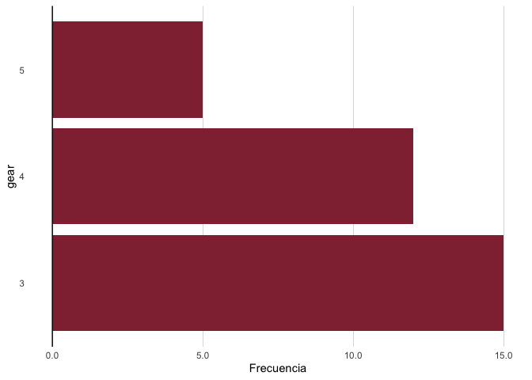

<!-- README.md is generated from README.Rmd. Please edit that file -->

# GPViz

<!-- badges: start -->

<!-- badges: end -->

## Installation

You can install GPViz like so:

``` r
devtools::install_github("gorantesj/GPViz")
```

## Demo

``` r
library(GPViz)
graficar_frecuencia(mtcars, variable=gear)
```


